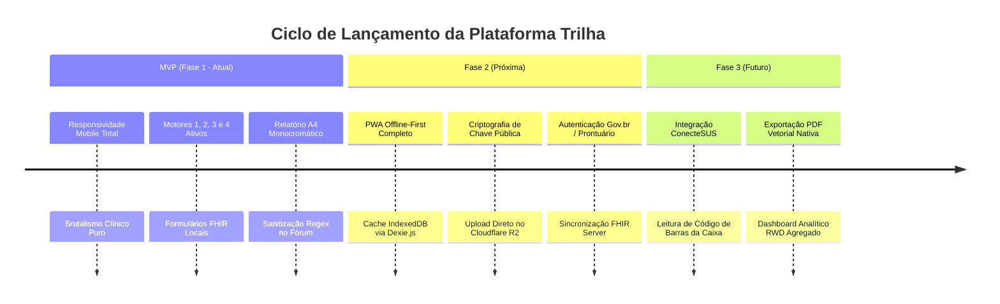
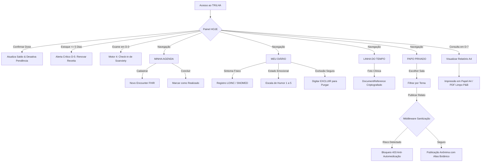
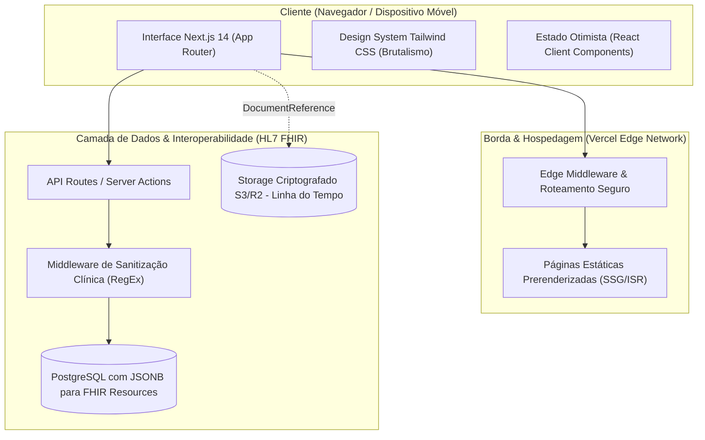

# ESPECIFICAÇÃO TÉCNICA, ARQUITETURAL E DE PRODUTO (PRD)
## TRILHA // CADERNETA CLÍNICA ONCOLÓGICA

---

## 1. Visão Geral e Objetivos (O "Porquê")

### 1.1 Objetivo do Projeto
O **TRILHA** é uma infraestrutura digital orientada aos princípios do **Brutalismo Clínico** e aos padrões internacionais **HL7 FHIR Release 4**, projetada para resolver o abandono, a descontinuidade farmacológica e o isolamento somatoemocional de pacientes no período crítico de sobrevida oncológica (especialmente no seguimento de 5 a 10 anos de câncer de mama).

#### O Problema Clínico e Operacional:
1. **Descontinuidade Silenciosa da Hormonioterapia**: Cerca de 40% a 50% das pacientes em tratamento adjuvante com moduladores hormonais (Tamoxifeno, Anastrozol, Letrozol) abandonam a terapia antes do 5º ano devido a efeitos colaterais cumulativos (fogachos, artralgia, fadiga severa) e burocracia logística no SUS / Farmácias de Alto Custo.
2. **Scanxiety e Sobrecarga Emocional**: A proximidade de exames periódicos de controle (mamografias, ultrassonografias, tomografias) induz picos documentados de ansiedade antecipatória (*scanxiety*), frequentemente somatizados e desprovidos de espaço de escuta clínica.
3. **Assimetria de Informação no Consultório**: No retorno ambulatorial (que dura de 10 a 15 minutos), a paciente esquece até 70% das queixas ocorridas nos 90 dias anteriores, enquanto o oncologista carece de Dados de Mundo Real (*Real-World Data - RWD*) estruturados para ajuste terapêutico.
4. **Vulnerabilidade a Terapias Falsas**: Redes sociais tradicionais repletas de algoritmos de engajamento expõem pacientes fragilizadas a promessas de curas milagrosas e desinformação perigosa.

#### A Meta de Negócio e Saúde Pública:
- Elevar a taxa de retenção terapêutica (PDC - *Proportion of Days Covered*) para acima de **90%** ao longo do ciclo plurianual.
- Reduzir o tempo de compilação da anamnese médica ambulatorial, gerando um documento físico impresso padrão A4 que se integra ao fluxo de trabalho tradicional do oncologista do SUS sem exigir telas abertas na consulta.

---

### 1.2 Público-Alvo (Personas)

#### Persona 1: A Paciente em Sobrevida (Usuária Primária)
- **Perfil**: Mulher, 42 a 65 anos, diagnosticada com Carcinoma Ductal Infiltrante luminal, submetida a cirurgia/radioterapia, iniciando o 2º ano de Tamoxifeno.
- **Dores**: Fadiga crônica matinal, dores articulares nas mãos, medo paralisante de recidiva a cada exame de imagem, desgaste com a renovação da receita médica a cada 6 meses.
- **Necessidades**: Interface direta, sem botões minúsculos, sem pop-ups, sem notificações estridentes, com lembrete matemático claro de reposição da medicação e espaço anônimo para troca de experiências sem julgamentos.

#### Persona 2: O Médico Oncologista Assistente (Usuário Receptor)
- **Perfil**: Médico oncologista de centro de alta complexidade (CACON/UNACON ou clínica conveniada), atendendo 20 a 30 pacientes por turno.
- **Dores**: Prontuários eletrônicos hospitalares lentos e fragmentados; falta de tempo para investigar queixas subjetivas; desconhecimento do nível real de adesão aos comprimidos em casa.
- **Necessidades**: Relatório em papel A4, em alto contraste monocromático, contendo tabela estruturada de adesão percentual, código LOINC de sintomas recorrentes e pauta concisa de perguntas prioritárias trazida em mãos pela paciente.

#### Persona 3: O Cuidador / Rede de Apoio Familiar
- **Perfil**: Filha(o), companheira(o) ou cuidador formal que gerencia a logística dos medicamentos de alto custo e acompanha a rotina de exames.
- **Necessidades**: Visão objetiva do saldo de caixas, data exata do próximo retorno e avisos claros de iminência de desabastecimento (D-5).

---

### 1.3 Indicadores de Sucesso (KPIs)

| Indicador | Definição / Métrica | Meta Alvo |
| :--- | :--- | :--- |
| **MPR / PDC (Adesão)** | *Medication Possession Ratio* e Proporção de Dias Cobertos do Tamoxifeno | $\ge 92\%$ em 12 meses |
| **Gatilho de Renovação** | Ação tomada antes do esgotamento da caixa (alerta crítico D-5) | $100\%$ de renovações antes de D-0 |
| **Aproveitamento de Consulta** | Resolução da Pauta Automática de Dúvidas trazida na consulta | $\ge 80\%$ das dúvidas abordadas |
| **Mitigação de Scanxiety** | Realização do check-in de descompressão em D-3 do exame de imagem | Redução percebida de 40% na tensão somática |
| **Segurança da Comunidade** | Detecção de tentativas de indicação de automedicação/chás milagrosos | $100\%$ bloqueadas via regex antes da gravação |

---

## 2. Escopo e Funcionalidades (O "O Quê")

### 2.1 Lista de Funcionalidades (Feature List por Módulo)

#### Módulo 1: Painel "Hoje" (Cockpit Clínico Operacional)
- **Motor 1 (Consulta D-7)**: Detecção automática da proximidade do retorno médico e geração imediata do botão de acesso ao Relatório Clínico A4.
- **Motor 2 (NLP de Pauta)**: Algoritmo heurístico que mapeia sintomas com $\ge 3$ ocorrências nos últimos 90 dias e sugere inserção proativa na pauta de perguntas ao médico.
- **Motor 3 (Controle Farmacológico & Estoque D-5)**: Registro diário da tomada da dose com Optimistic UI; cálculo matemático de saldo restante da caixa; disparo de alerta visual de risco quando estoque $\le 5$ comprimidos.
- **Motor 4 (Descompressão de Scanxiety D-3)**: Monitoramento da proximidade de exames de imagem e disponibilização de formulário terapêutico de anotação de tensão somática.

#### Módulo 2: Minha Agenda (FHIR Encounter)
- Registro temporal de eventos clínicos (mamografias, exames laboratoriais, fisioterapia para linfedema, consultas).
- Alternância de status entre `planned` e `finished` com persistência local e timestamps normatizados ISO-8601.
- Filtragem rápida sem recarregar a tela por status da competência.

#### Módulo 3: Meu Diário (FHIR Observation)
- Formulário dual: registro de **Sintoma Físico** (LOINC/SNOMED-CT) ou **Escala Funcional de Humor** (escala de 1 a 5 categorizada clinicamente).
- Histórico cronológico linear com identificadores únicos FHIR.
- Mecanismo estrito de exclusão destrutiva inline (digitação da palavra "EXCLUIR", sem pop-ups acidentais).

#### Módulo 4: Linha do Tempo Visual (FHIR DocumentReference)
- Registro de referências a imagens clínicas de monitoramento (reconstrução mamária, cicatrização pós-mastectomia, evolução de linfedema de braço).
- Armazenamento de metadados, identificador criptografado do storage e descrições biométricas (ex: perímetros em centímetros).

#### Módulo 5: Papo Privado (Comunidade Anônima Desacoplada)
- Suporte entre pares estruturado em salas temáticas aprovadas (*Hormonioterapia*, *Linfedema*, *Reconstrução*, *Emocional*).
- Geração determinística de pseudônimos botânicos únicos (ex: `JACARANDA-892`, `BROMELIA-304`), impedindo identificação civil.
- Middleware regex de sanitização clínica que impede termos de automedicação, alteração de conduta ou pseudociência.
- Simulação de sincronização resiliente via Long Polling a cada 15 segundos.

#### Módulo 6: Relatório Clínico Impresso (Padrão SUS / A4)
- Formatação pura em alto contraste preto e branco para economia de tinta e máxima legibilidade física.
- Tabelas clínicas de adesão, sintomas e exames complementares.
- Espaço analógico com linhas dedicadas a anotações manuais, carimbo e CRM do médico oncologista.

---

### 2.2 Escopo Negativo (Out of Scope para a Versão Atual)
- **Sem Telemedicina Síncrona**: O app não realiza videochamadas nem substitui consultas clínicas.
- **Sem Comércio de Remédios**: Proibida qualquer funcionalidade de venda, repasse ou doação de medicamentos entre usuários.
- **Sem Algoritmos de Feed Social**: Proibido feed por relevância, fotos de perfil de rosto, contagem de curtidas ou métricas de vaidade.
- **Sem Notificações Push Invasivas**: Nada de push estridente ou marketing persuasivo que gere dependência digital ou gatilhos de ansiedade desnecessários.

---

### 2.3 Fases de Lançamento (Roadmap de Evolução)



---

## 3. Requisitos Funcionais e Comportamento (O "Como")

### 3.1 Histórias de Usuário (User Stories)

1. **Como** uma paciente em hormonioterapia adjuvante,  
   **eu quero** marcar com um único toque que tomei meu comprimido diário e ver quantos dias de medicação restam na caixa,  
   **para que** eu nunca interrompa meu tratamento por esquecimento ou falta de receita.

2. **Como** uma usuária com mamografia agendada para daqui a 3 dias,  
   **eu quero** registrar meus pensamentos e sintomas de ansiedade no espaço de descompressão (*scanxiety*),  
   **para que** eu possa externalizar o estresse e normalizar essa reação psicológica documentada.

3. **Como** uma paciente retornando à consulta com o oncologista,  
   **eu quero** imprimir uma folha A4 com todo o histórico de queixas recorrentes e adesão percentual dos últimos 90 dias,  
   **para que** o médico tome decisões baseadas em dados concretos sem que eu esqueça de nada.

4. **Como** uma paciente com dúvidas sobre linfedema,  
   **eu quero** interagir em uma sala temática sob um pseudônimo botânico anônimo,  
   **para que** eu possa compartilhar experiências de autocuidado com outras mulheres sem expor meu diagnóstico ou prontuário real.

---

### 3.2 Regras de Negócio Fundamentais

| Código | Regra de Negócio | Comportamento do Sistema |
| :--- | :--- | :--- |
| **RN-01** | **Cálculo de Esgotamento (D-5)** | $\text{Saldo} = \text{Total da Caixa} - \text{Doses Tomadas}$. Se $\text{Saldo} \le 5$, exibe imediatamente o banner amarelo de alerta crítico de prioridade máxima no topo do painel "Hoje". |
| **RN-02** | **Janela de Scanxiety (D-3)** | Se houver evento do tipo exame de imagem agendado entre 1 e 3 dias da data atual, o banner do Motor 4 é ativado automaticamente. |
| **RN-03** | **Heurística de Pauta Médica (Motor 2)** | Sintomas no Diário registrados com frequência $\ge 3$ ocorrências em um intervalo móvel de 90 dias são sugeridos automaticamente para inclusão na pauta impressa. |
| **RN-04** | **Sanitização de Comunidade (Regex)** | Textos contendo padrões como `/(dobrar dose|parar de tomar|cloroquina|ozonioterapia|cura milagrosa|chá milagroso|substituir remédio)/i` disparam erro 403 clínico imediato, abortando a postagem. |
| **RN-05** | **Exclusão com Barreira Cognitiva** | A exclusão de qualquer registro de prontuário (Observação, Documento ou Agendamento) exige digitação deliberada da palavra `"EXCLUIR"` em caixa alta, sem modais flutuantes. |
| **RN-06** | **Dimensão Mínima de Toque (WCAG 2.1 AA)** | Qualquer elemento interativo (botão, input, link, checkbox de dose) deve possuir área mínima de toque de $48 \times 48\text{px}$ (ou $44\text{px}$ com espaçamento compensatório no mobile). |

---

### 3.3 Fluxo do Usuário (User Flow)



---

## 4. Experiência Visual (UX & UI)

### 4.1 Filosofia do Brutalismo Clínico
O design do TRILHA rejeita intencionalmente o visual convencional de "aplicativo de bem-estar com tons pastéis suaves e ilustrações infantis". Tratar sobrevivência oncológica exige respeito, seriedade funcional e alta legibilidade sob estresse emocional ou fadiga física.

- **Ausência de Sombras ou Elevações (Zero Z-Axis)**: Não existem modais suspensos, menus gaveta (*hamburgers*), overlays translúcidos ou efeitos de desfoque (*backdrop-blur*). Tudo é plano, bidimensional e com bordas pretas sólidas (`2px` a `4px`).
- **Navegação Não-Oclusiva**: No mobile, abas e botões não cobrem o conteúdo. Menus rolam horizontalmente de forma contínua e sem quebras visuais confusas.
- **Microinterações Instantâneas**: Transições de tela com duração nula (`transition: none !important`), reduzindo latência cognitiva e prevenindo tontura ou náusea em pacientes pós-quimioterapia.

### 4.2 Guia de Estilo (Design System)

```
=============================================================================
                    PALETA INSTITUCIONAL DO SISTEMA TRILHA
=============================================================================
[ #F4F4EB ]  PAPEL JORNAL CLÍNICO  (Fundo Primário e Alto Contraste)
[ #1A4331 ]  VERDE FLORESTA ESCURO (Identidade do SUS / Ações Primárias)
[ #7C2D3A ]  VINHO TERROSO         (Módulo do Diário / Emoções / Atenção)
[ #2E7D32 ]  VERDE CONFIRMAÇÃO     (Adesão Farmacológica / Status Concluído)
[ #B8860B ]  OURO / MOSTARDA       (Alertas Logísticos Críticos D-5 / D-3)
[ #000000 ]  PRETO ABSOLUTO        (Bordas Estruturais, Títulos e Textos)
[ #FFFFFF ]  BRANCO PURO           (Área Interna de Cartões e Tabelas A4)
=============================================================================
```

#### Tipografia Normatizada
- **Títulos e Cabeçalhos (`h1` a `h6`)**: `Merriweather`, Georgia, serifada. Transmite autoridade documental e legibilidade editorial clássica.
- **Dados Técnicos, Identificadores e Badges**: `JetBrains Mono`, monospace. Comunica precisão algorítmica, timestamps FHIR e rastreabilidade clínica.
- **Corpo de Texto e Instruções**: `Arial`, Helvetica, sans-serif. Escrita funcional, limpa e acessível em qualquer dispositivo.

---

## 5. Requisitos Não-Funcionais (Qualidade e Segurança)

### 5.1 Plataformas e Dispositivos
- **Web App Responsivo (PWA)**: Funciona nativamente em iOS (Safari 15+), Android (Chrome 100+), Windows, macOS e Linux.
- **Suporte a Resoluções Críticas**: Desde telas compactas de $320\text{px}$ (iPhone SE 1ª geração / Androids básicos) até monitores $4\text{K}$.
- **Modo de Impressão (`@media print`)**: Layout de impressão A4 nativo que oculta cabeçalhos de navegação, remove barras de rolagem e maximiza contraste para impressão econômica no SUS.

### 5.2 Segurança, Privacidade e LGPD
1. **Desacoplamento Criptográfico Unidirecional**: O identificador do prontuário da paciente (`BR-ONCO-9482-SUS`) jamais é transmitido ou associado às postagens do módulo *Papo Privado*. Na comunidade, a paciente existe apenas como um pseudônimo aleatório derivado de botânica nacional (`JACARANDA-892`).
2. **Conformidade com a LGPD (Lei 13.709/2018 - Art. 11)**: Dados de saúde são categorizados como **Dados Pessoais Sensíveis**. O TRILHA opera sob princípio de minimização estrita da coleta (*privacy by design*).
3. **Criptografia em Trânsito e Repouso**: Comunicações sob **TLS 1.3** obrigatório com HTTPS forçado e cabeçalhos de segurança rígidos (`HSTS`, `X-Content-Type-Options: nosniff`).

### 5.3 Desempenho e Resiliência
- **First Contentful Paint (FCP)**: $< 0.8\text{ segundos}$ em conexões 4G.
- **Largest Contentful Paint (LCP)**: $< 1.4\text{ segundos}$.
- **Cumulative Layout Shift (CLS)**: $0.00$ (zero deslocamento de tela após o carregamento).
- **Bundle JS**: Compilação estática com menos de $100\text{ KB}$ de JavaScript inicial compartilhado.

---

## 6. Requisitos Técnicos e Arquitetura (Para Desenvolvedores)

### 6.1 Diagrama de Arquitetura do Sistema



### 6.2 Modelagem de Dados Baseada no HL7 FHIR R4

As interfaces TypeScript do sistema ([types/clinical.ts](file:///c:/Users/aalin/OneDrive/Área de Trabalho/bula facil/trilha/types/clinical.ts)) refletem diretamente a especificação formal do HL7 FHIR:

```typescript
// 1. Recurso para Adesão Medicamentosa
export interface MedicationStatementResource {
  resourceType: "MedicationStatement";
  id: string;
  status: "active" | "completed" | "stopped" | "on-hold";
  medicationCodeableConcept: {
    coding: Array<{ system: "RxNorm"; code: string; display: string }>;
  };
  dosage: Array<{ text: string; doseAndRate?: Array<{ doseQuantity: { value: number; unit: string } }> }>;
  effectivePeriod: { start: string; end?: string };
}

// 2. Recurso para Sintomas e Estados Emocionais
export interface ObservationResource {
  resourceType: "Observation";
  id: string;
  categoryCode: "symptom" | "emotional_state";
  codeSystem: "LOINC" | "SNOMED-CT";
  codeValue: string; // Ex: LOINC 88020-3 (Fadiga)
  valueString: string;
  effectiveDateTime: string; // ISO-8601
}

// 3. Recurso para Consultas e Procedimentos
export interface EncounterResource {
  resourceType: "Encounter";
  id: string;
  status: "planned" | "arrived" | "triaged" | "in-progress" | "finished";
  class: "ambulatory" | "inpatient" | "emergency";
  type: string;
  periodStart: string;
  title: string;
  notes?: string;
}

// 4. Recurso para Registro Fotográfico
export interface DocumentReferenceResource {
  resourceType: "DocumentReference";
  id: string;
  typeCode: "clinical-photo";
  contentAttachmentUrl: string;
  created: string;
  description: string;
}
```

### 6.3 Estrutura de Arquivos e Componentes

```
trilha/
├── app/
│   ├── agenda/page.tsx          # Gestão de Encounters (Consultas/Exames)
│   ├── comunidade/page.tsx      # Salas Anônimas de Suporte com Sanitização
│   ├── diario/page.tsx          # Registro de Sintomas e Escala de Humor
│   ├── fotos/page.tsx           # DocumentReference de Imagens Clínicas
│   ├── relatorio-print/page.tsx # Compilação Monocromática A4 para Impressão
│   ├── globals.css              # Reset Brutalista e Utilitários de Rolagem
│   ├── layout.tsx               # Root Layout com Viewport e Header Global
│   └── page.tsx                 # Entrada apontando para o Painel "Hoje"
├── components/
│   ├── HeaderNavigation.tsx     # Barra de Navegação Horizontal Swipeable
│   └── Hoje.tsx                 # Cockpit Operacional com Motores 1, 2, 3 e 4
├── types/
│   └── clinical.ts              # Tipagem Estruturada Padrão HL7 FHIR R4
└── tailwind.config.ts           # Definição de Cores e Tokens do Design System
```

---

*Documento homologado para o ecossistema TRILHA // Protocolo de Sobrevida Oncológica.*
